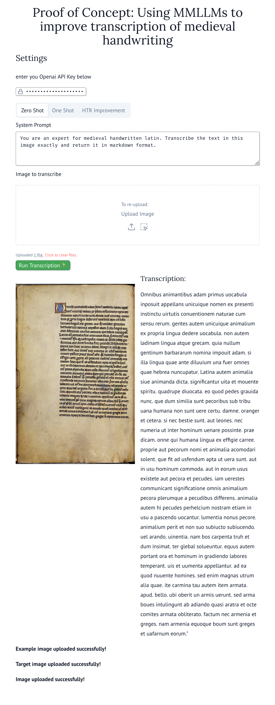
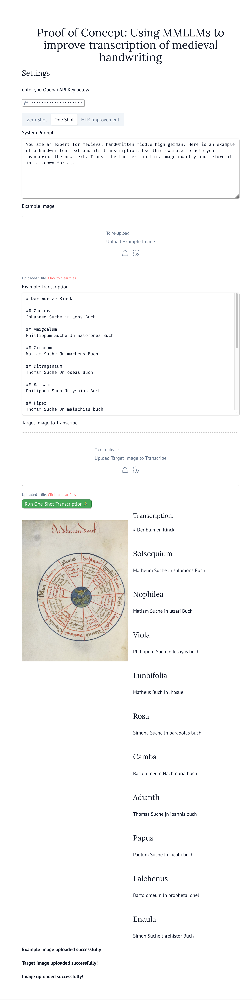
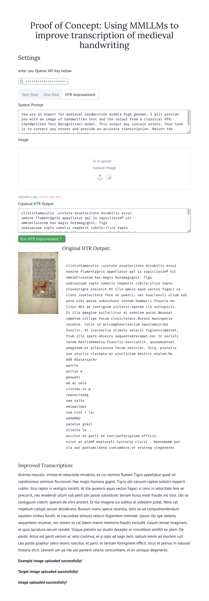

# Improving Historical Text Recognition with Multimodal LLMs

This project demonstrates how to use multimodal large language models (specifically GPT-4o) to improve the transcription of historical handwritten texts. The interactive marimo notebook provides three different approaches to transcription:

1. **Zero Shot** - Direct transcription of handwritten text without examples
2. **One Shot** - Transcription using an example image and its known transcription 
3. **HTR Improvement** - Improving outputs from classical HTR (Handwritten Text Recognition) models

## 📋 Overview

Historical Text Recognition (HTR) is challenging due to variations in handwriting styles, document degradation, and non-standard layouts. This project leverages the visual understanding capabilities of multimodal LLMs to improve transcription accuracy, particularly for medieval manuscripts and other historical documents.

## 🚀 Setup and Installation

### Prerequisites

- Python 3.10+
- A valid OpenAI API key

### Installation with UV

We recommend using [UV](https://github.com/astral-sh/uv), a fast Python package installer and resolver:

```bash
# Install uv if you don't have it
curl -sSf https://astral.sh/uv/install.sh | bash

# Clone the repository
git clone https://github.com/your-username/improving-htr-with-genai.git
cd improving-htr-with-genai

# Create a virtual environment and install dependencies
uv venv
uv pip install marimo openai pydantic
```

### Alternative Installation with pip

```bash
# Clone the repository
git clone https://github.com/your-username/improving-htr-with-genai.git
cd improving-htr-with-genai

# Create a virtual environment
python -m venv venv
source venv/bin/activate  # On Windows: venv\Scripts\activate

# Install dependencies
pip install marimo openai pydantic
```

## 💻 Running the Notebook

```bash
# Start the marimo notebook
marimo edit poc_notebooks/lot-books.py
```

This will open the marimo notebook in your default web browser.

## 📝 Using the Notebook

1. Enter your OpenAI API key in the settings section
2. Choose one of the three approaches (tabs):

### Zero Shot
- Upload a handwritten text image
- Click "Run Transcription"
- View the transcribed text alongside the original image

### One Shot
- Upload an example image with known handwriting
- Enter the correct transcription for the example
- Upload the target image you want to transcribe
- Click "Run One-Shot Transcription"
- View the transcribed text alongside the original image

### HTR Improvement
- Upload a handwritten text image
- Paste the output from a classical HTR model
- Click "Run HTR Improvement"
- View both the original HTR output and the improved transcription


## 🧠 How It Works

The notebook uses GPT-4o (via the OpenAI API) to analyze images of handwritten text:

- **Zero Shot**: Sends the image directly to GPT-4o with a prompt to transcribe it
- **One Shot**: Provides an example image and its correct transcription to help GPT-4o better understand the handwriting style
- **HTR Improvement**: Sends both the image and the initial OCR output to GPT-4o, asking it to correct any errors

## ��️ Example Outputs

Below are examples demonstrating the capabilities of this tool on historical documents:

### Zero Shot Transcription



### One Shot Transcription



### HTR Improvement



## 🌐 Deploying to GitHub Pages

This project includes a GitHub Action workflow to automatically deploy the notebook as an interactive web app on GitHub Pages.

When you push changes to the main branch, the notebook will be automatically deployed and accessible at `https://<username>.github.io/<repository-name>/`.


## 📄 License

[MIT License](LICENSE)
